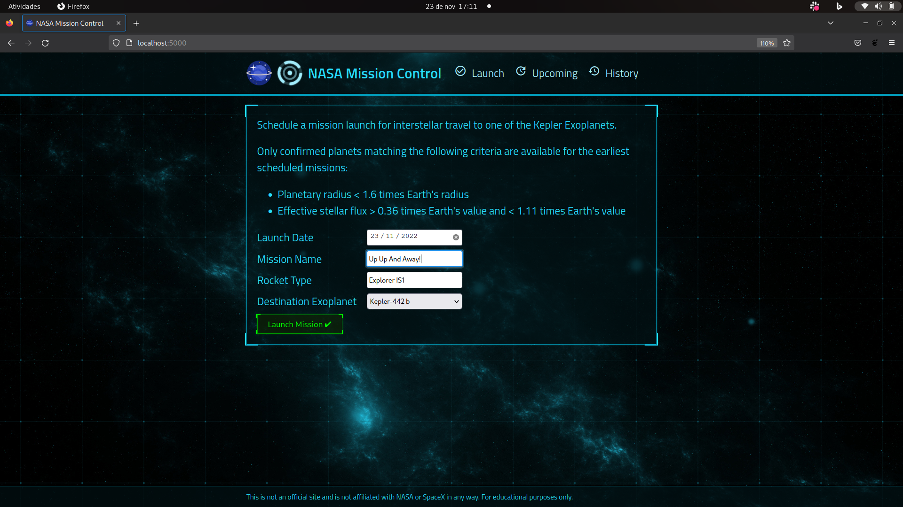
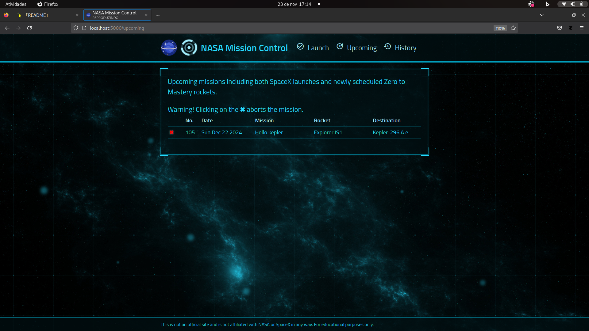
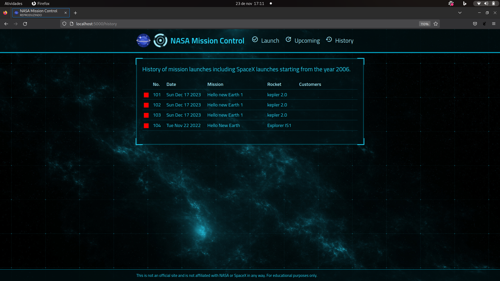

# Nasa Launcher Project

Projeto de um sistema de controle de lançamentos de Foguetes nasa Para possíveis 
planetas habitavéis. 

<div align="center">
 
</div>

## Screenshots

 

<div style="display:flex;gap:1rem;">
 
 
</div>


## Stack utilizada

**Front-end:** React, [Arwes](https://arwes.dev/)

**Back-end:** Node, Express, Typescript, [Prisma](https://www.prisma.io/) , [MongoDb](https://www.mongodb.com/cloud/atlas/lp/try4?utm_source=google&utm_campaign=search_gs_pl_evergreen_atlas_core_prosp-brand_gic-null_amers-br_ps-all_desktop_eng_lead&utm_term=mongodb&utm_medium=cpc_paid_search&utm_ad=e&utm_ad_campaign_id=12212624308&adgroup=115749706023&gclid=CjwKCAiApvebBhAvEiwAe7mHSLJM5ajDkPkNR55paJoN_NTqJMOZ4QaLKzWuxax3PCapD4JOz56tWBoC820QAvD_BwE)  

**Testes:** [Vitest](https://vitest.dev/), [Supertest](https://www.npmjs.com/package/supertest)  

## Aprendizados

Conseguir criar toda uma aplicação de ponta a ponta foi um desafio, que veio com a habilidade 
de visualizar de forma concreta como cada parte do software vai se comunucar, testar todas essass camadas, consegui desde modelar o meu banco de forma que eu conseguisse representar corretamente as minhas
entidades, e lidar com boas praticas da orientação a objetos no backend.E no lado do front consegui criar uma interface com uma biblioteca que nunca tinha
usado anteriomente. A tomada de decisão sobre qual ferramenta eu usaria e me traria mais produtividade foi sem duvida algo interessante de vivenciar.


## Rodando localmente

Clone o projeto

```bash
git clone https://github.com/ewertonribeiro/nasa_project.git```

Entre no diretório do projeto

```bash
cd nasa_project
```

Instale as dependências

```bash
  npm install
```


## Variáveis de Ambiente

Para rodar esse projeto, você vai precisar adicionar a seguinte variável de ambiente no seu .env

`DATABASE_URL` = sua chave do cluster mongodb.

Inicie o servidor

```bash
  npm run deploy
```

Leia o ```package.json``` para ver mais scripts.


## Licença

[MIT](https://choosealicense.com/licenses/mit/)


